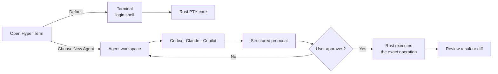

<div align="center">
  

<h1>Hyper Term</h1>

<p><strong>A local-first terminal for humans and coding agents.</strong></p>
  <p>A normal terminal by default. An Agent workspace only when you choose it.</p>

<p>
    <a href="LICENSE"></a>
    
    
  </p>
</div>

Hyper Term is an open-source, macOS-first terminal. Open it and you get a real
login shell. When you need a coding agent, create a separate Agent tab for
structured messages, approvals, diffs, and generated interfaces.

<p align="center">
  
</p>

> [!IMPORTANT]
> Hyper Term is in active development. You can build and run it from source, but
> it is not ready for production use or general distribution.

## Why Hyper Term?

- **Terminal first.** New tabs open the user's login shell with normal job
  control, signals, resize, UTF-8, CJK/IME input, search, and scrollback.
- **Agent mode is explicit.** A normal Terminal tab never starts a model or
  changes shell behavior.
- **You stay in control.** Agents propose operations; Rust checks permissions
  and waits for approval before execution or workspace writes.
- **Approvals are bound to what you reviewed.** Native trusted chrome shows the
  Rust-projected command or MCP identity, argument boundaries, and a bounded
  canonical preview of built-in MCP arguments with its full digest, working
  directory, capabilities, and risk. Each authorization carries the matching
  detail digest and operation revision; stale or substituted arguments fail
  closed before dispatch.
- **Local by default.** PTYs, process lifecycle, transcripts, and accepted
  artifacts stay under the local Rust core. WebViews only render trusted data.

Agent tabs can connect to locally installed Codex, Claude, and GitHub Copilot
CLIs. They present plans and tool calls as structured, searchable blocks, and
can open generated React/TypeScript artifacts in an isolated editor and preview.
For each accepted artifact revision, the Workbench measures a Rust-owned matrix
covering narrow, tablet, desktop, dark-theme, reduced-motion, keyboard-focus,
fixed `zh-CN` long-content, and declarative empty/loading/error/disabled
environments, then persists a revision-bound visual quality report. Generated
artifacts expose state blocks through bounded `data-hyper-state` markup; the
host selects and measures those blocks without executing artifact-supplied test
code. The checker remains explicitly `needs review` until host-pixel evidence
exists; browser observations cannot mark their own output ready.

Press `Command-F` in an Agent tab to filter its retained messages, tools, files,
and approvals; ordinary Terminal tabs keep terminal-native find.
Terminal rendering stays on the fast WebGL path by default. Screen-reader users
can press `Shift-Tab` from Terminal input to reveal **Enable screen reader
mode**, then press `Enter`; the preference is local and adds xterm's navigable
row list and live output region without slowing every terminal session.

## How it works



The key boundary is simple: the UI and agent may propose an action, but only the
Rust permission broker can execute it. Terminal output is always treated as
untrusted data.

## Get started

### Requirements

- macOS
- Rust `1.95` (pinned by `rust-toolchain.toml`)
- Deno `2.9.3`
- Zig `0.16.0`
- Native SDK CLI `0.5.3`

Clone the repository and check the Deno runtime:

```bash
git clone https://github.com/phodal/hyper-term.git
cd hyper-term
deno task verify:runtime
```

Build the Terminal, Workbench, and native application:

```bash
deno task build:terminal
deno task build:workbench
(cd apps/desktop && native build --release=fast -Dtrace=off)
```

Build the static Web Renderer Kit separately when embedding the same Terminal
and Agentic UI surfaces in another host:

```bash
deno task package:web
```

The generated `dist/web-renderers` has a responsive launcher, the Terminal
renderer, the standalone TSX/Preview Workbench, `esbuild.wasm`, and a
SHA-256 file inventory. Native SDK 0.5.3 does not provide a Web target, so this
is deliberately a Deno-built Web/WASM renderer kit rather than a false claim
that the Native canvas compiles to a browser. The Terminal renderer still needs
the authenticated Rust PTY gateway; the Workbench demo can run from any static
HTTP server.

Start Hyper Term:

```bash
cargo run -p hyper-term-daemon --bin hyper-term-desktop -- \
  --ui "$PWD/apps/desktop/zig-out/bin/hyper-term" \
  --terminal-assets "$PWD/dist/terminal" \
  --workbench-assets "$PWD/dist/workbench"
```

The app opens as a normal terminal; no agent provider is required. When an
installed Codex or Claude CLI needs authentication, the Agent provider menu
offers **Sign in … in Terminal**. Hyper Term opens an ordinary Terminal tab and
copies the fixed login command; it never executes the command for you. Paste,
review, press Return, then choose **Refresh** to let Rust re-check readiness.
Run `cargo run -p hyper-term-daemon --bin hyper-term-desktop -- --help` to see
provider-path options.

### Build a local macOS app

```bash
./scripts/package_macos_app.sh
open "dist/macos/Hyper Term.app"
```

This creates an ad-hoc signed development build. Public signed and notarized
builds are published by the tag-driven GitHub Release workflow after its
protected `Release` environment supplies the Apple credentials documented in
[the macOS release guide](docs/release/macos-app.md). Suffixed tags can publish
an explicitly unsigned prerelease when those credentials are intentionally
absent.

## Development

Run the Rust checks:

```bash
cargo clippy --workspace --all-targets -- -D warnings
cargo test --workspace
```

Run the Deno checks:

```bash
deno task verify:runtime
deno task verify:deno-lsp
deno task check
deno task test
deno task build:terminal
deno task build:workbench
deno task assemble:web
deno task verify:web-browser
deno task verify:terminal-browser
deno task verify:workbench-browser
```

Hyper Term uses Deno's frozen lockfile and built-in bundler. There is no Vite or
pnpm build. The optional browser gate requires `agent-browser`; it edits the
built Workbench, waits for the esbuild-wasm live preview, opens the editable
Diff, enforces a 100 ms warm edit-to-preview p95 with no main-thread long tasks,
measures 100/500/1,000-module Worker slice rebuilds and cancellation, and
verifies the Artifact editor and Preview remain side by side at the Native
pane width, then become an editor-first stack below 640 px. The compact Agent
Studio remains reachable at 480 px. The authenticated Artifact gate starts
from visible `/App.tsx`, requires zero initial Deno LSP errors, edits the TSX
through CodeMirror, and captures the newer live Preview revision.
Semantics-sensitive module
features fall back to a complete esbuild build, while authoritative artifact
publication remains a Rust-supervised Deno build.

## Project map

```text
apps/desktop/               Native macOS application
apps/terminal/              Terminal renderer
apps/workbench/             Agent blocks, editor, and artifact preview
crates/hyper-term-core/     PTYs, state, and renderer-independent authority
crates/hyper-term-daemon/   Daemon, desktop supervisor, and local gateways
crates/hyper-term-drivers/  Agent, MCP, Deno LSP, and GenUI adapters
crates/hyper-term-protocol/ Shared contracts
crates/hyper-term-sandbox/  OS sandbox backends
docs/                       Architecture, research, and release notes
```

Start with these documents when you want more detail:

- [Product and interaction design](DESIGN.md)
- [Runtime authority boundaries](docs/architecture/0002-runtime-authority-boundaries.md)
- [Native SDK product shell](docs/architecture/0013-native-sdk-default-product-shell.md)
- [Coding-agent sandbox](docs/architecture/0014-rust-owned-coding-agent-sandbox.md)
- [macOS release process](docs/release/macos-app.md)

## Current status

The PTY kernel, native Terminal tabs, structured Agent tabs, provider adapters,
and isolated artifact preview all have runnable baselines. Workspace apply,
replay, sandboxing, and the Workbench are still experimental. The Rust desktop
supervisor keeps PTY and Agent gateways alive while it performs a bounded
restart of a crashed Native renderer. Terminal and Agent tab layout, the active
tab, and Agent session bindings are restored across that renderer replacement.
The same layout and active tab also survive a full application restart through
private Rust-owned state. Agent tabs reattach their existing Rust
`BlockDocument` history through a bounded private Task ID binding, while the
provider process and every Terminal PTY still start fresh instead of pretending
their old processes survived. The current focus is reliability, accessibility,
containment, and signed macOS distribution.

## Roadmap

- Keep zsh-compatible Terminal startup, input, resize, search, and burst output
  on a fast path independent from Agent availability.
- Keep provider sign-in recovery, permission review, and real Codex, Claude,
  and Copilot ACP compatibility release-gated without giving Native or WebViews
  process authority.
- Extend the Deno/esbuild-wasm Agentic UI loop beyond its React editing,
  bounded Diff, live preview, runtime traces, semantic Time Travel, and
  host-owned visual-evidence foundation.
- Keep every source file within 2,000 lines by extracting cohesive View, Model,
  protocol, and test modules before a responsibility becomes a new hotspot.
- Harden Tier 2 isolation and cross-platform packaging while keeping
  accessibility, crash recovery, signing, notarization, and the once-daily
  prerelease pipeline continuously verified.

## Contributing

Issues and focused pull requests are welcome. Read [AGENTS.md](AGENTS.md) before
changing protocols or process lifecycle behavior, and add a regression test for
every such change. Keep source files within 2,000 lines and split them at a
cohesive View, Model, protocol, or test boundary. Keep `hyper-term-core`
independent from the renderer and keep command and filesystem authority out of
WebViews.

## License

Hyper Term is licensed under the [Apache License 2.0](LICENSE). Third-party
components and notices are listed in
[THIRD_PARTY_NOTICES.md](THIRD_PARTY_NOTICES.md).
