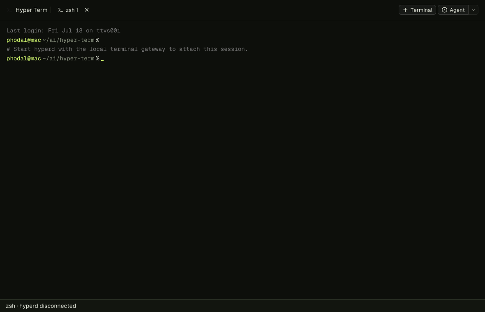
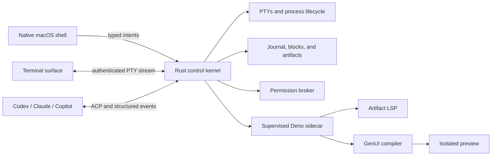

<div align="center">
  

  <h1>Hyper Term</h1>

  <p><strong>A local-first terminal for humans and coding agents.</strong></p>
  <p>A normal terminal by default. A structured Agent workspace when you ask for one.</p>

  <p>
    <a href="LICENSE"></a>
    
    
  </p>
</div>

Hyper Term is an open-source, macOS-first terminal that keeps the familiar PTY
experience and adds an explicit workspace for structured coding agents. Shells,
agent sessions, approvals, diffs, and generated interfaces share one durable
task model without giving the UI direct command or filesystem authority.

<p align="center">
  
</p>

<p align="center"><sub>Generated from the real Native SDK widget tree, layout, design tokens, and Geist glyph outlines.</sub></p>

> [!IMPORTANT]
> Hyper Term is in active development. The terminal core and macOS application
> are runnable, but the project is not ready for production use or general
> distribution yet.

## Features

- **A real terminal first.** New tabs open the user's login shell with job
  control, resize, `Ctrl-C`, UTF-8, CJK/IME input, truecolor, ordered output,
  and reconnectable scrollback.
- **Explicit Agent mode.** Agent sessions live in their own tabs; opening a
  normal terminal never starts a model or changes shell behavior.
- **Structured coding-agent sessions.** ACP adapters turn messages, plans, tool
  calls, approvals, and results into typed blocks instead of scraping ANSI
  output.
- **Codex, Claude, and Copilot adapters.** Hyper Term discovers locally
  installed provider CLIs and connects through provider-specific, supervised
  adapters. Provider binaries and credentials are never bundled.
- **Generated UI artifacts.** Agents can propose React/TypeScript interfaces
  that are compiled by a pinned Deno runtime, content-addressed by Rust, and
  shown in a network-closed preview.
- **Brokered Agent tools.** ACP and Codex sessions receive a digest-pinned MCP
  server with bounded Diff, GenUI compile, and Deno LSP tools. Every call is an
  operation proposal; Rust and the user authorize it before execution.
- **Artifact Workbench.** Current artifacts can open in a CodeMirror editor with
  Diff, Rust-journaled Time Travel, source-mapped diagnostics, completion, and
  an isolated local preview. A historical revision can be loaded as a local
  draft without replaying effects. Publishing creates an Approval Block and a
  new Rust-accepted revision compiled by pinned Deno; it does not write to the
  workspace.
- **Local-first authority.** Rust owns PTYs, process lifetime, permissions,
  durable state, and accepted artifacts. WebViews render trusted projections
  and cannot spawn commands or choose arbitrary files.
- **Native macOS shell.** The desktop application uses a Native SDK window with
  a fast ordinary Terminal surface and contextual Agent/editor panes.

## How it works



The central rule is simple: **presentation proposes; Rust authorizes and
executes**. `hyper-term-core` is renderer-independent, terminal output is
always treated as untrusted data, and bulk PTY traffic does not cross a generic
UI bridge.

## Project status

| Area | Status |
| --- | --- |
| Rust PTY kernel, journal, reconnect, and input lease | Implemented baseline |
| Native macOS Terminal tabs | Active development |
| Structured ACP Agent tabs | Active development |
| Codex and Claude packaged ACP adapters | Implemented baseline |
| GitHub Copilot ACP discovery | Implemented baseline |
| ACP/Codex brokered MCP tools: Diff, GenUI, and Deno LSP | Implemented baseline |
| Generated artifact storage and isolated preview | Implemented baseline |
| Multi-file Artifact editor, Diff, durable accepted-revision Time Travel, diagnostics, completion, and approved publish | Experimental |
| Brokered exact single-file Artifact apply | Experimental |
| Signed and notarized public releases | Not available yet |
| Linux and Windows desktop applications | Not available yet |

Agent providers require a compatible CLI already installed and authenticated on
the local machine. Hyper Term packages the adapter runtime, not the provider
CLI or account credentials.

## Quick start

### Prerequisites

- macOS
- Rust `1.95` (pinned by `rust-toolchain.toml`)
- Deno `2.9.3`
- Zig `0.16.0`
- Native SDK CLI `0.5.3`

Clone the repository and verify the pinned toolchain:

```bash
git clone https://github.com/phodal/hyper-term.git
cd hyper-term
deno task verify:runtime
```

Build the terminal, Workbench, and native renderer:

```bash
deno task build:terminal
deno task build:workbench
(cd apps/desktop && npx -y @native-sdk/cli@0.5.3 build --release=fast)
```

Run the integrated development application:

```bash
cargo run -p hyper-term-daemon --bin hyper-term-desktop -- \
  --ui "$PWD/apps/desktop/zig-out/bin/hyper-term" \
  --terminal-assets "$PWD/dist/terminal" \
  --workbench-assets "$PWD/dist/workbench"
```

This starts an ordinary terminal without requiring an Agent provider. To use an
Agent tab, install and authenticate a supported provider CLI first, then pass an
explicit provider path when needed; see `hyper-term-desktop --help` for the
available flags.

### Build the macOS application

With `native` available on `PATH`, create an ad-hoc signed local application:

```bash
./scripts/package_macos_app.sh
open "dist/macos/Hyper Term.app"
```

The package contains the Rust supervisor, Native SDK renderer, terminal and
Workbench assets, and the pinned Deno/ACP runtime. It does not require a global
Node.js runtime after packaging.

### Run the kernel only

The renderer-independent daemon can also run on its own:

```bash
cargo run -p hyper-term-daemon --bin hyperd -- \
  --state-dir .hyper-term \
  --socket .hyper-term/hyperd.sock
```

## Development

Run the Rust gates:

```bash
cargo clippy --workspace --all-targets -- -D warnings
cargo test --workspace
```

Run the Workbench gates:

```bash
deno task verify:runtime
deno task check
deno task test
deno task build:workbench
```

Regenerate and test the README's vector UI preview:

```bash
deno task render:readme
deno task check:readme-svg
deno task test:native-svg
```

The adapter imports the desktop application's actual `main.zig` and
`app.native`, then hands the resulting scene to Native SDK's reusable SVG
exporter. The preview therefore follows UI layout and token changes without a
second mockup, while the converter remains usable by other Native SDK apps.

This repository intentionally uses Deno's frozen lockfile and built-in bundler;
there is no Vite or pnpm build.

## Repository layout

```text
apps/desktop/               Native SDK macOS application
apps/terminal/              Terminal WebView renderer
apps/workbench/             Agent blocks, editor, and isolated artifact preview
packages/native-svg/        Hyper Term adapter for Native SDK SVG export
crates/hyper-term-core/     Renderer-independent state and PTY authority
crates/hyper-term-daemon/   Daemon, desktop supervisor, and local gateways
crates/hyper-term-drivers/  ACP, MCP, Deno LSP, and GenUI supervision
crates/hyper-term-protocol/ Versioned domain and wire contracts
crates/hyper-term-sandbox/  Fail-closed OS sandbox backends
runtime/                    Pinned Deno and ACP runtime manifests
scripts/                    Build, verification, and packaging tools
docs/                       Architecture decisions, research, and release notes
```

Useful design documents:

- [Product and interaction design](DESIGN.md)
- [Runtime authority boundaries](docs/architecture/0002-runtime-authority-boundaries.md)
- [Deno-first Workbench build](docs/architecture/0010-deno-first-static-workbench-build.md)
- [Native SDK product shell](docs/architecture/0013-native-sdk-default-product-shell.md)
- [macOS release process](docs/release/macos-app.md)

## Roadmap

- Harden terminal performance, accessibility, reconnect, and recovery gates.
- Extend the brokered exact single-file Artifact apply transaction to
  multi-file/hunk review and crash-recoverable worktree commits, without giving
  the renderer write authority.
- Extend accepted-Artifact Time Travel into journaled editor transactions,
  reducer/runtime trace checkpoints, and redacted offline bug capsules.
- Strengthen containment for external coding-agent processes.
- Publish signed and notarized Apple Silicon and Intel builds.
- Define the supported-platform contract before expanding beyond macOS.

## Contributing

Issues and focused pull requests are welcome. Before changing a protocol or
process lifecycle, read [AGENTS.md](AGENTS.md), add a regression test, and run
the Rust and Deno gates above. Please keep `hyper-term-core` independent from
the desktop renderer and keep machine authority out of WebViews.

## License

Hyper Term is licensed under the [Apache License 2.0](LICENSE). Third-party
components and notices are listed in [THIRD_PARTY_NOTICES.md](THIRD_PARTY_NOTICES.md).
