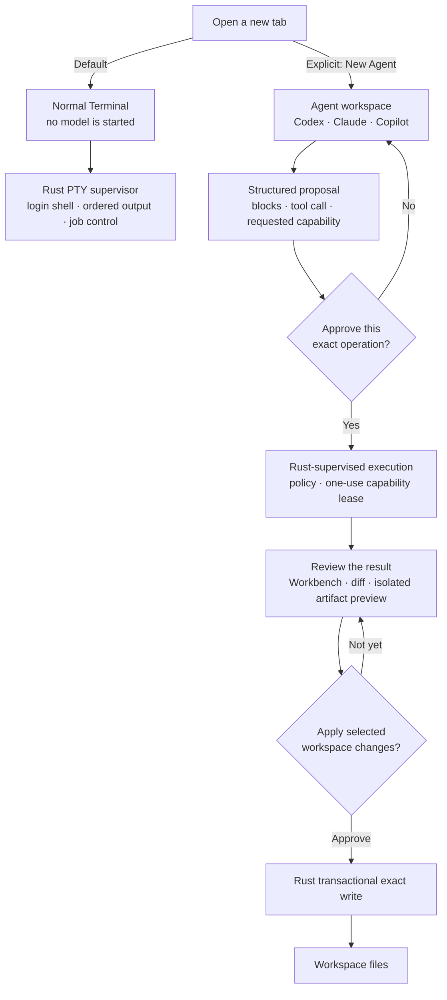

<div align="center">
  

  <h1>Hyper Term</h1>

  <p><strong>A local-first terminal for humans and coding agents.</strong></p>
  <p>A normal terminal by default. A structured Agent workspace when you ask for one.</p>

  <p>
    <a href="LICENSE"></a>
    
    
  </p>
</div>

Hyper Term is an open-source, macOS-first terminal that keeps the familiar PTY
experience and adds an explicit workspace for structured coding agents. Shells,
agent sessions, approvals, diffs, and generated interfaces share one durable
task model without giving the UI direct command or filesystem authority.

<p align="center">
  
</p>

<p align="center"><sub>Generated from the real Native SDK widget tree, layout, design tokens, and Geist glyph outlines.</sub></p>

> [!IMPORTANT]
> Hyper Term is in active development. The terminal core and macOS application
> are runnable, but the project is not ready for production use or general
> distribution yet.

## Features

- **A real terminal first.** New tabs open the user's login shell with job
  control, resize, `Ctrl-C`, UTF-8, CJK/IME input, truecolor, ordered output,
  reconnectable scrollback, `Command-F` history search, and persistent
  `Command-Plus` / `Command-Minus` font zoom.
- **Explicit Agent mode.** Agent sessions live in their own tabs; opening a
  normal terminal never starts a model or changes shell behavior.
- **Structured coding-agent sessions.** ACP adapters turn messages, plans, tool
  calls, approvals, and results into typed blocks instead of scraping ANSI
  output. The Native transcript consumes ordered, frame-coalesced Block patches;
  revision gaps fall back to one bounded snapshot instead of polling or
  serializing the complete history for every model delta.
- **Codex, Claude, and Copilot adapters.** Hyper Term discovers locally
  installed provider CLIs and connects through provider-specific, supervised
  adapters. An explicit ACP path wins; automatic mode prefers the
  digest-inventoried offline adapter bundled with Hyper Term, then falls back
  to a recognized installed Zed or Agent Client Protocol package whose package
  identity, version, and executable entrypoint agree. Provider binaries and
  credentials are never bundled.
- **Generated UI artifacts.** Agents can propose React/TypeScript interfaces
  that are compiled by a pinned Deno runtime, content-addressed by Rust, and
  shown in a network-closed preview.
- **Brokered Agent tools.** ACP and Codex sessions receive a digest-pinned MCP
  server with bounded Diff, GenUI compile, and Deno LSP tools. Every call is an
  operation proposal; Rust and the user authorize it before execution.
- **Artifact Workbench.** Current artifacts can open in a CodeMirror editor with
  Diff, Rust-journaled Time Travel, source-mapped diagnostics, completion, and
  an isolated local preview. Explicit `useReplayReducer` state can be rebuilt
  through a selected semantic event; replay verifies the Rust projection
  digest and substitutes ordered effect receipts without invoking their live
  callbacks. A historical source revision can still be loaded as a local draft
  without replaying effects. Publishing creates an Approval Block and a new
  Rust-accepted revision compiled by pinned Deno; it does not write to the
  workspace. The panel stays hidden for Terminal and ordinary Agent tabs and
  opens only for an ACP session with a current editable Artifact.
- **Exact hunk apply.** The Workbench maps Artifact files to explicit workspace
  targets, previews Rust-computed hunks without creating an operation, and lets
  the user bind a selected multi-file set to one exact WorkspaceWrite approval.
  Rust journals the staged transaction outside the workspace and recovers an
  interrupted commit or rollback before another workspace apply can begin.
- **Offline Bug Capsule replay.** A Rust-generated capsule can be reopened with
  `--bug-capsule`; Rust validates its schema, projection identity, inventory,
  and integrity digest before exposing it through a token-only read endpoint.
  Native opens a dedicated Capsule tab, while the Workbench can inspect and
  scrub semantic replay events without a live Agent, shell, MCP, or filesystem
  authority.
- **Local-first authority.** Rust owns PTYs, process lifetime, permissions,
  durable state, and accepted artifacts. WebViews render trusted projections
  and cannot spawn commands or choose arbitrary files.
- **Native macOS shell.** The desktop application uses a Native SDK window with
  a fast ordinary Terminal surface and contextual Agent/editor panes.

## Terminal by default. Agent by choice.

A new tab is an ordinary terminal. Agent mode is an explicit choice, and an
Agent provider can propose an operation but cannot execute it or write to the
workspace through the UI.



The important boundary is not Native versus Web. It is **who has authority**:

- Terminal input goes to a real login PTY without starting a model.
- Agent, MCP, and Deno output remains a proposal until Rust accepts an approved
  operation.
- Agent-generated workspace changes require a separate exact apply; Rust writes
  them transactionally, never the WebView or provider.

## Project status

| Area | Status |
| --- | --- |
| Rust PTY kernel, journal, reconnect, and input lease | Implemented baseline |
| Native macOS Terminal tabs | Active development |
| Structured ACP Agent tabs | Active development |
| Codex and Claude packaged ACP adapters | Implemented baseline |
| GitHub Copilot ACP discovery | Implemented baseline |
| macOS Seatbelt plus managed proxy for Codex and ACP control processes | Implemented Tier 1 baseline |
| Rust-owned exact-commit Tier 2 worktree, ephemeral Lima VM runner, read-before-approve Diff, and reviewed text/binary apply | Experimental baseline |
| ACP/Codex brokered MCP tools: Diff, GenUI, and Deno LSP | Implemented baseline |
| Generated artifact storage and isolated preview | Implemented baseline |
| Multi-file Artifact editor, Diff, deterministic reducer replay, effect receipts, diagnostics, completion, and approved publish | Experimental |
| Brokered exact multi-file Artifact-to-workspace apply with hunk selection and crash recovery | Experimental |
| Bounded offline Bug Capsule export, verified open, and replay-only viewer | Experimental |
| Signed and notarized public releases | Not available yet |
| Linux and Windows desktop applications | Not available yet |

Agent providers require a compatible CLI already installed and authenticated on
the local machine. Hyper Term packages the adapter runtime, not the provider
CLI or account credentials. The Agent provider menu refreshes Rust-owned login
status when opened, so authentication completed in a Terminal tab is available
without restarting the app. Agent sessions started from an oversized directory
such as the user's home still retain Diff and GenUI MCP tools, but Deno LSP is
omitted until a bounded workspace can be snapshotted safely.

## Quick start

### Prerequisites

- macOS
- Rust `1.95` (pinned by `rust-toolchain.toml`)
- Deno `2.9.3`
- Zig `0.16.0`
- Native SDK CLI `0.5.3`

Clone the repository and verify the pinned toolchain:

```bash
git clone https://github.com/phodal/hyper-term.git
cd hyper-term
deno task verify:runtime
```

Build the terminal, Workbench, and native renderer:

```bash
deno task build:terminal
deno task build:workbench
(cd apps/desktop && npx -y @native-sdk/cli@0.5.3 build --release=fast)
```

Run the integrated development application:

```bash
cargo run -p hyper-term-daemon --bin hyper-term-desktop -- \
  --ui "$PWD/apps/desktop/zig-out/bin/hyper-term" \
  --terminal-assets "$PWD/dist/terminal" \
  --workbench-assets "$PWD/dist/workbench"
```

This starts an ordinary terminal without requiring an Agent provider. To use an
Agent tab, install and authenticate a supported provider CLI first, then pass an
explicit provider path when needed; see `hyper-term-desktop --help` for the
available flags. A stable global install of `@zed-industries/codex-acp` or
`@agentclientprotocol/codex-acp` is discovered automatically; Hyper Term does
not invoke a networked `npx` install during application startup.

Open a previously exported Bug Capsule without starting an Agent session:

```bash
cargo run -p hyper-term-daemon --bin hyper-term-desktop -- \
  --ui "$PWD/apps/desktop/zig-out/bin/hyper-term" \
  --terminal-assets "$PWD/dist/terminal" \
  --workbench-assets "$PWD/dist/workbench" \
  --bug-capsule /absolute/path/to/report.bug-capsule.json
```

The path is opened only by Rust. The Native/WebView surfaces receive a bounded
authenticated projection and cannot select or read arbitrary local files.

### Build the macOS application

With `native` available on `PATH`, create an ad-hoc signed local application:

```bash
./scripts/package_macos_app.sh
open "dist/macos/Hyper Term.app"
```

The package contains the Rust supervisor, Native SDK renderer, terminal and
Workbench assets, and the pinned Deno/ACP runtime. It does not require a global
Node.js runtime after packaging.

Verify the exact assembled bundle without opening a window:

```bash
"dist/macos/Hyper Term.app/Contents/MacOS/hyper-term" --verify-bundle
```

This re-hashes the packaged Terminal, Workbench, GenUI, and ACP inventories,
checks the bundled Deno 2.9.3 executable, and rejects missing, added, symlinked,
or modified frontend assets. The release workflow runs the same command after
signing and notarization and before creating each GitHub archive.

ACP terminal-host requests are available only when the desktop supervisor has
an explicitly pinned Tier 2 backend. Hyper Term never downloads a VM image and
never falls back to the user's ordinary PTY. With Lima 2.1.1 or newer and a
local VZ-compatible image, launch the packaged application with:

```bash
"dist/macos/Hyper Term.app/Contents/MacOS/hyper-term" \
  --lima /absolute/path/to/limactl \
  --lima-image /absolute/path/to/image.qcow2 \
  --lima-image-sha256 <lowercase-sha256>
```

The same values can be supplied as `HYPER_TERM_LIMA_PATH`,
`HYPER_TERM_LIMA_IMAGE`, and `HYPER_TERM_LIMA_IMAGE_SHA256`. If the image or
digest is absent, ACP does not negotiate the Terminal capability; normal zsh
tabs and brokered Diff, GenUI, and bounded Deno LSP tools remain available.

### Run the kernel only

The renderer-independent daemon can also run on its own:

```bash
cargo run -p hyper-term-daemon --bin hyperd -- \
  --state-dir .hyper-term \
  --socket .hyper-term/hyperd.sock
```

## Development

Run the Rust gates:

```bash
cargo clippy --workspace --all-targets -- -D warnings
cargo test --workspace
```

Run the opt-in real Tier 2 VM conformance gate with a local, digest-pinned
aarch64 cloud image and Lima 2.1.1 or newer:

```bash
HYPER_TERM_LIMA_IMAGE=/absolute/path/to/image.qcow2 \
HYPER_TERM_LIMA_IMAGE_SHA256=<lowercase-sha256> \
cargo test -p hyper-term-sandbox \
  real_lima_runs_an_offline_unprivileged_exact_commit_task \
  -- --ignored --nocapture
```

The test proves that the real VZ guest runs as a non-root user without task
network access, writes only the exact-commit worktree, and leaves no VM or Lima
instance behind. The image is never downloaded implicitly by Hyper Term.

Run the Workbench gates:

```bash
deno task verify:runtime
deno task check
deno task test
deno task build:workbench
```

Run the real macOS desktop smoke after building the terminal, Workbench,
debug supervisor, and an automation-enabled Native renderer:

```bash
cargo build -p hyper-term-daemon --bin hyper-term-desktop
(cd apps/desktop && native build --release=fast -Dautomation=true)
./scripts/smoke_macos_desktop.sh
```

The smoke starts the complete Rust supervisor and Native application in an
isolated temporary directory. It enforces a 150 ms cold-start first-frame cap
locally (matching Native SDK's first-frame budget; shared release runners set an
explicit virtualization allowance) plus Native's canvas frame budget, then
verifies the canvas-first launch, deferred real Terminal WebView attachment,
default Terminal mode, `Command-T`, `Command-W`, accessibility labels,
Agent/Goal interactions, and a non-empty retained-canvas screenshot. The separate GenUI WebView stays
unmounted until an ACP artifact editor or verified Capsule needs it. The release
workflow uploads the snapshot, screenshot, and supervisor log as evidence
instead of treating a successful compile as desktop-runtime proof.

Regenerate and test the README's vector UI preview:

```bash
deno task render:readme
deno task check:readme-svg
deno task test:native-svg
```

The adapter imports the desktop application's actual `main.zig` and
`app.native`, then hands the resulting scene to Native SDK's reusable SVG
exporter. The preview therefore follows UI layout and token changes without a
second mockup, while the converter remains usable by other Native SDK apps.

This repository intentionally uses Deno's frozen lockfile and built-in bundler;
there is no Vite or pnpm build.

## Repository layout

```text
apps/desktop/               Native SDK macOS application
apps/terminal/              Terminal WebView renderer
apps/workbench/             Agent blocks, editor, and isolated artifact preview
packages/native-svg/        Hyper Term adapter for Native SDK SVG export
crates/hyper-term-core/     Renderer-independent state and PTY authority
crates/hyper-term-daemon/   Daemon, desktop supervisor, and local gateways
crates/hyper-term-drivers/  ACP, MCP, Deno LSP, and GenUI supervision
crates/hyper-term-protocol/ Versioned domain and wire contracts
crates/hyper-term-sandbox/  Fail-closed OS sandbox backends
runtime/                    Pinned Deno and ACP runtime manifests
scripts/                    Build, verification, and packaging tools
docs/                       Architecture decisions, research, and release notes
```

Useful design documents:

- [Product and interaction design](DESIGN.md)
- [Runtime authority boundaries](docs/architecture/0002-runtime-authority-boundaries.md)
- [Deno-first Workbench build](docs/architecture/0010-deno-first-static-workbench-build.md)
- [Native SDK product shell](docs/architecture/0013-native-sdk-default-product-shell.md)
- [macOS release process](docs/release/macos-app.md)

## Roadmap

- Harden terminal performance, accessibility, reconnect, and recovery gates.
- Run a pinned production Tier 2 image through the release conformance gate.
  The Native review card recovers retained results, marks deletions explicitly,
  renders bounded Rust-generated text Diffs, and identifies binary changes by
  byte count and SHA-256 before it creates the separate workspace-apply
  approval.
- Maintain golden version 1 fixtures for accepted source, Artifact editor,
  runtime trace, and Bug Capsule imports, and require every future schema
  upgrade to preserve their source or deterministic replay identities.
- Move opaque provider-internal execution from the read-only macOS Tier 1
  control-process boundary into the Tier 2 runner once its container/VM and
  resource-limit gates pass.
- Publish signed and notarized Apple Silicon and Intel builds.
- Define the supported-platform contract before expanding beyond macOS.

## Contributing

Issues and focused pull requests are welcome. Before changing a protocol or
process lifecycle, read [AGENTS.md](AGENTS.md), add a regression test, and run
the Rust and Deno gates above. Please keep `hyper-term-core` independent from
the desktop renderer and keep machine authority out of WebViews.

## License

Hyper Term is licensed under the [Apache License 2.0](LICENSE). Third-party
components and notices are listed in [THIRD_PARTY_NOTICES.md](THIRD_PARTY_NOTICES.md).
